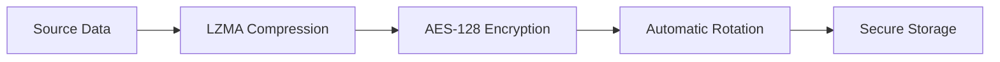

# Auto-Backup Professional

A robust, encrypted backup solution with automated lifecycle management.

## 🔒 Security Architecture
Data integrity and confidentiality are ensured via a multi-stage pipeline:



## 💎 Features
- **Zero-Knowledge**: Data is encrypted locally before transmission/storage.
- **Space Efficiency**: LZMA2 compression (up to 90% reduction for text/logs).
- **Hardened Rotation**: FIFO-based snapshot management to prevent storage overflow.

## ⚙️ Configuration
The system uses `cryptography.fernet` for high-level symmetric encryption.

```python
# Internal Logic
key = Fernet.generate_key()
cipher = Fernet(key)
```